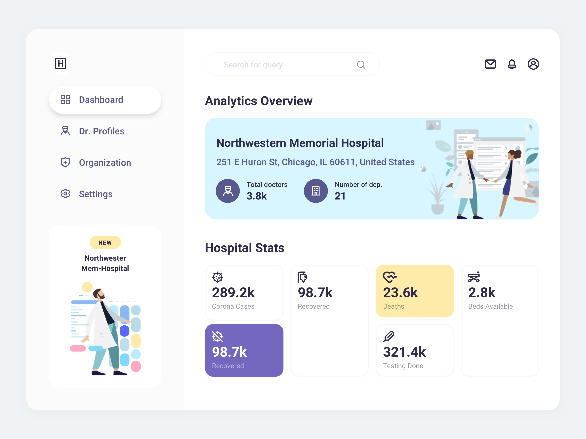

# Dashboard & Chat

The goal for this take-home assignment is to build a React app that resembles the following image closely. The idea is that we can see how you work from an image to an actual product. You'll implement the dashboard of this hospital app.

We created a skeleton app using [Vite](https://vitejs.dev/) and an API to fetch data from. You can customize the project as much as you want (or use other tooling if you prefer).

## Install and run

To install project dependencies, you can run `yarn`.
After that, you can run the application using `yarn start`. This command will run two scripts concurrently:

1. `yarn dev`
2. `node ./api/index.js`

The mock API should be available on `http://localhost:3005/hospital`.

## Requirements

- Follow the design as closely as possible
- Make it responsive. You can use your own judgment to decide what that should look like.
- Fetch the data from the API, and display it as shown on the design. Every new request will return new data, so you can be creative here ;)
- Style the different states (hover, active, etc.)

## Notes

- You can find the images and icons in the `/src/assets/` folder

## Deliverable

- A code repository we can pull and run `yarn; yarn start` on to be able to view the project
- The repository can be public, or a private github one shared with `jaapbakker88`, `tatianainama` and `rbp`

## Deadline

- There isn't one :)
- But please let us know what your estimate is of when you expect to hand it in.

## Bonus points

- Add animations
- Use a design system
