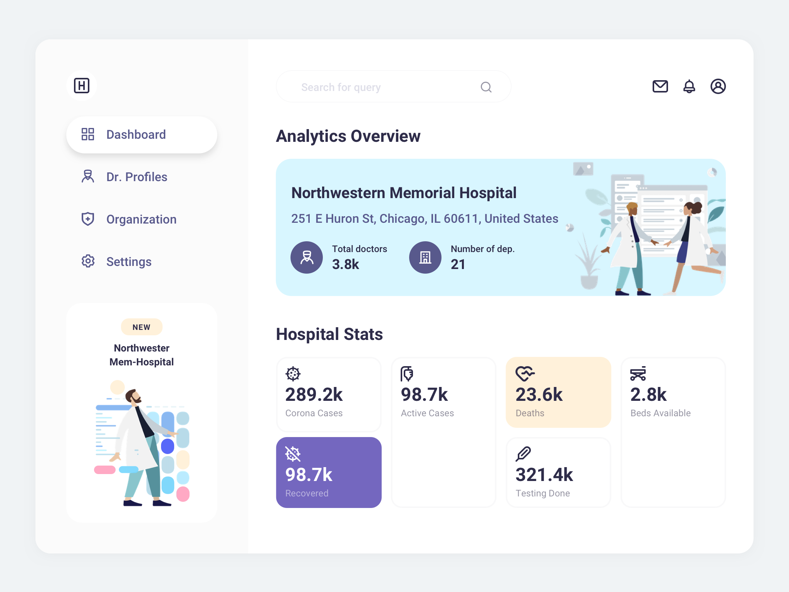

# Dashboard & Chat

The goal for this at-home assignment is to build a React app that resembles the following two images closely. The idea is that we can see how you work from an image to an actual product. You'll implement the dashboard of this hospital app.

## Requirements

- Follow the design as closely as possible
- Implement "Dashboard"
- Style the different states (hover, active, etc.)

## Notes

- You can find the images and icons in the `/src/assets/` folder

## Deliverable

- A public repository we can pull and run `yarn; yarn start` to be able to view the project

## Deadline

- There isn't one :)
- But please let us know what your estimate is of when you expect to hand it in.

## Bonus points

- Add animations
- Use a design system
